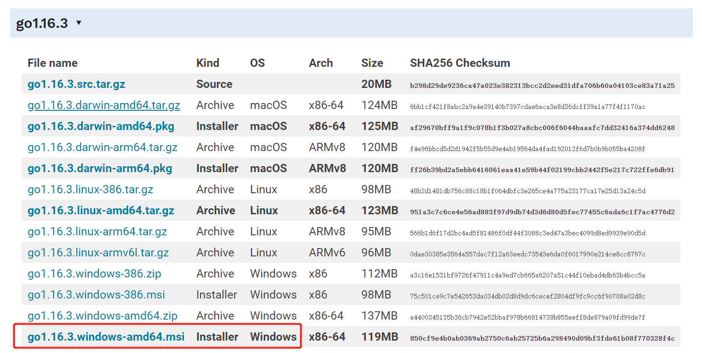
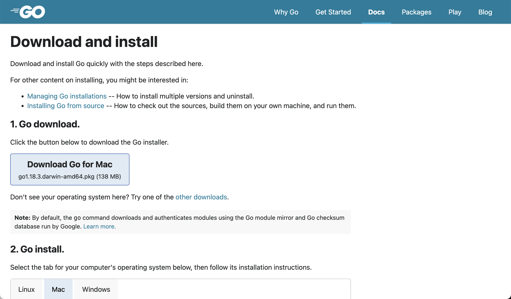
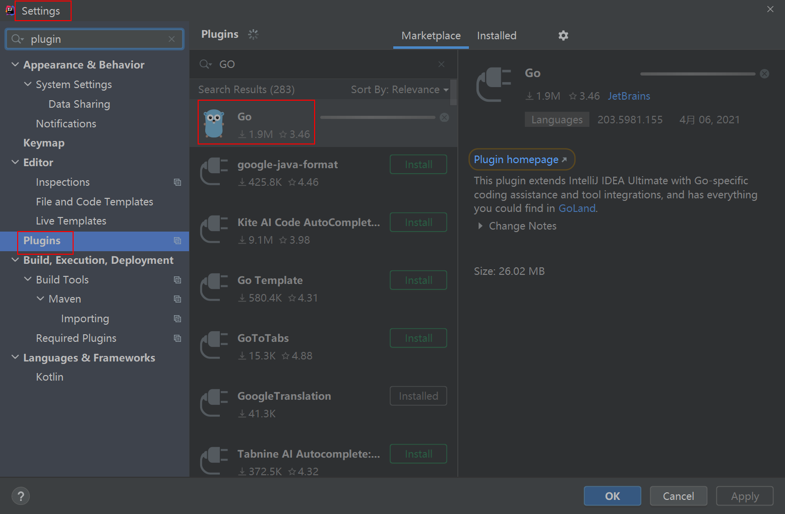
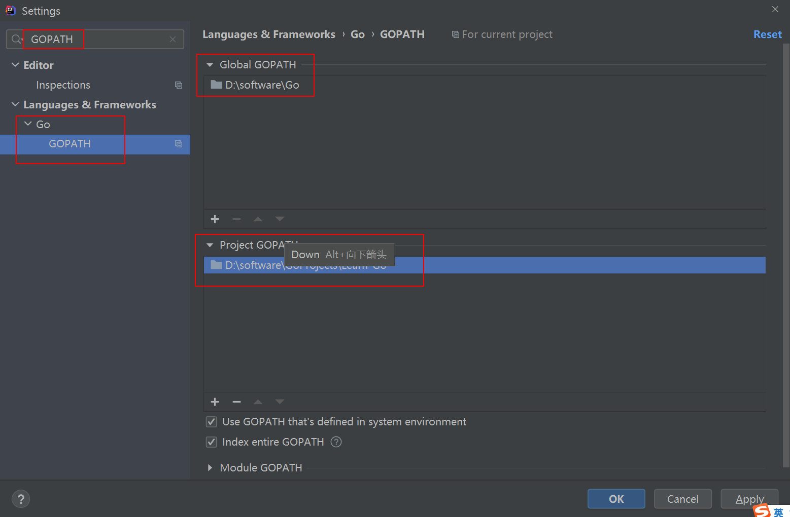

[TOC]

---

### 一、GO简介
1. Go官网：https://golang.google.cn/doc/
2. Go下载：https://golang.google.cn/dl/
3. GO网址导航：https://hao.studygolang.com/
4. Go语言入门教程汇总篇：https://mp.weixin.qq.com/s/ONE4afDx6QAzmdBDKGhdxw

---

### 二、Go环境
1. 下载Go安装包
下载地址（Win）：https://golang.google.cn/doc/install?download=go1.16.3.windows-amd64.msi

下载地址（Mac）：https://golang.google.cn/doc/install


2. 添加path变量  
D:\software\Go\bin   

3. 验证Go安装成功  
go version  


4. IDEA搭建Go环境  
1、File > Settings > Plugins ：选择Go安装  
  
2、File > Settings > Languages & Frameworks > Go >  GOPATH  
  

5. IDEA添加Go模板
File > Settings > Editor > File and Code Templates > Files > Go File
```
/**
  * @author       weimenghua
  * @time         ${YEAR}-${MONTH}-${DAY} ${TIME}
  * @description
  */
```

6. mac搭建Go环境
查看Go环境变量：go env
sudo vim ~/.zshrc
export GOROOT=/usr/local/go            #程序安装的位置
export GOPATH=~/IdeaProjects/Learn-Go  #项目位置
export PATH=$GOROOT/bin:$GOPATH        #总的路径
source ~/.zshrc

--- 

### 三、Go教程
#### 1、Go 语言结构
1. 包声明
2. 引入包
3. 函数
4. 变量
5. 语句 & 表达式
6. 注释

#### 2、举例子
```
package  main

import  "fmt"

func  main()  {
    /* 这是我的第一个简单的程序 */
    fmt.Println("Hello, World!")
}
```
1. 第一行代码 package main 定义了包名。你必须在源文件中非注释的第一行指明这个文件属于哪个包，如：package main。package main表示一个可独立执行的程序，每个 Go 应用程序都包含一个名为 main 的包。
2. 下一行 import "fmt" 告诉 Go 编译器这个程序需要使用 fmt 包（的函数，或其他元素），fmt 包实现了格式化 IO（输入/输出）的函数。
3. 下一行 func main() 是程序开始执行的函数。main 函数是每一个可执行程序所必须包含的，一般来说都是在启动后第一个执行的函数（如果有 init() 函数则会先执行该函数）。
4. 下一行 /*...*/ 是注释，在程序执行时将被忽略。单行注释是最常见的注释形式，你可以在任何地方使用以 // 开头的单行注释。多行注释也叫块注释，均已以 /* 开头，并以 */ 结尾，且不可以嵌套使用，多行注释一般用于包的文档描述或注释成块的代码片段。
5. 下一行 fmt.Println(...) 可以将字符串输出到控制台，并在最后自动增加换行字符 \n。使用 fmt.Print("hello, world\n") 可以得到相同的结果。 Print 和 Println 这两个函数也支持使用变量，如：fmt.Println(arr)。如果没有特别指定，它们会以默认的打印格式将变量 arr 输出到控制台。
6. 当标识符（包括常量、变量、类型、函数名、结构字段等等）以一个大写字母开头，如：Group1，那么使用这种形式的标识符的对象就可以被外部包的代码所使用（客户端程序需要先导入这个包），这被称为导出（像面向对象语言中的 public）；标识符如果以小写字母开头，则对包外是不可见的，但是他们在整个包的内部是可见并且可用的（像面向对象语言中的 protected ）。

#### 3、执行Go程序
运行go文件：go run main.go  
生成exe文件：go build main.go
